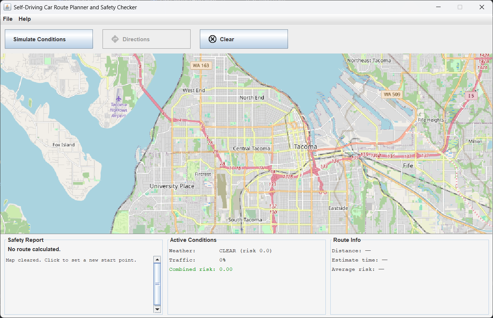
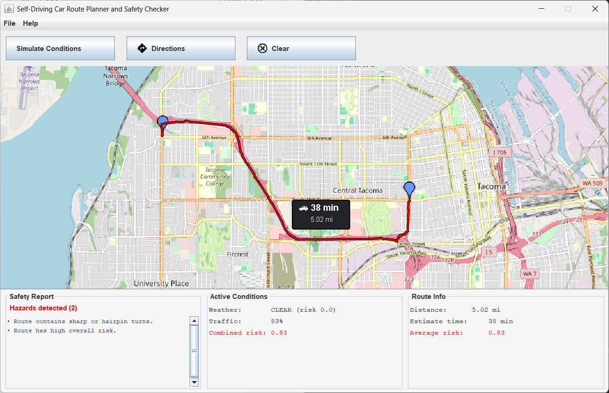
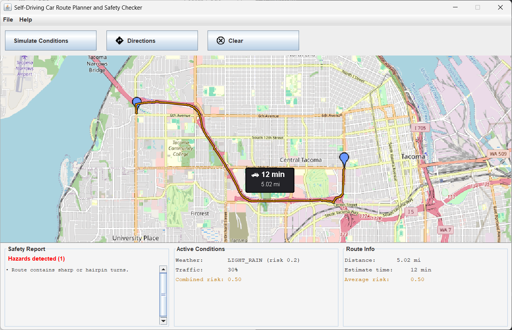
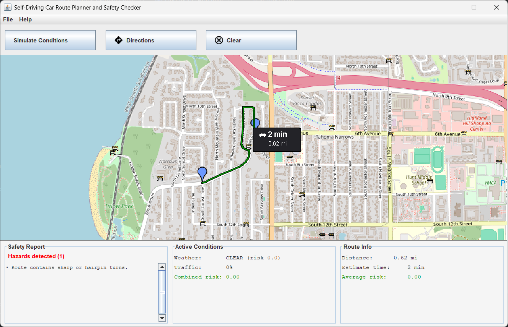
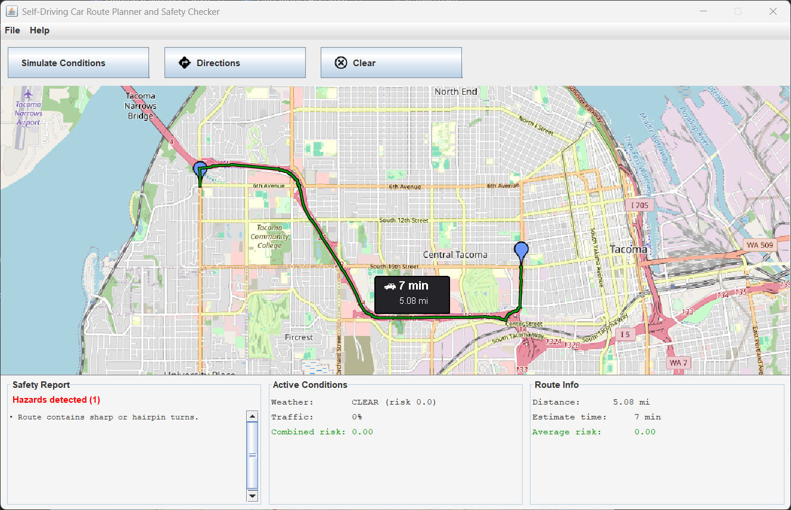
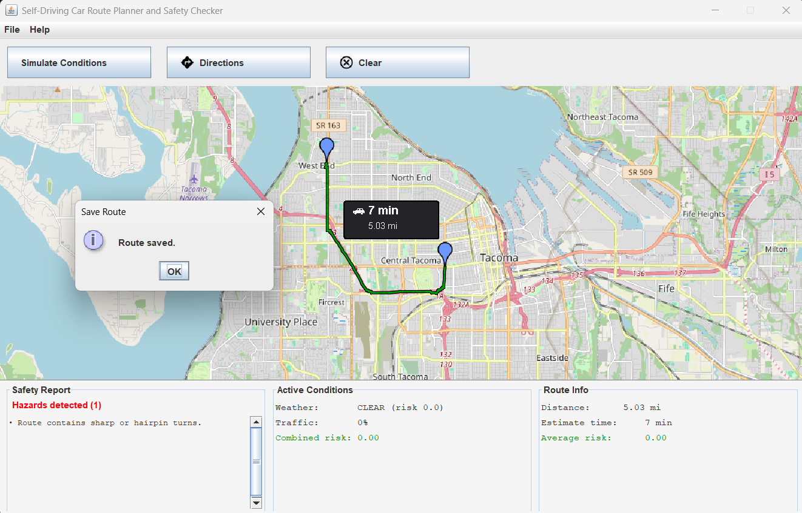
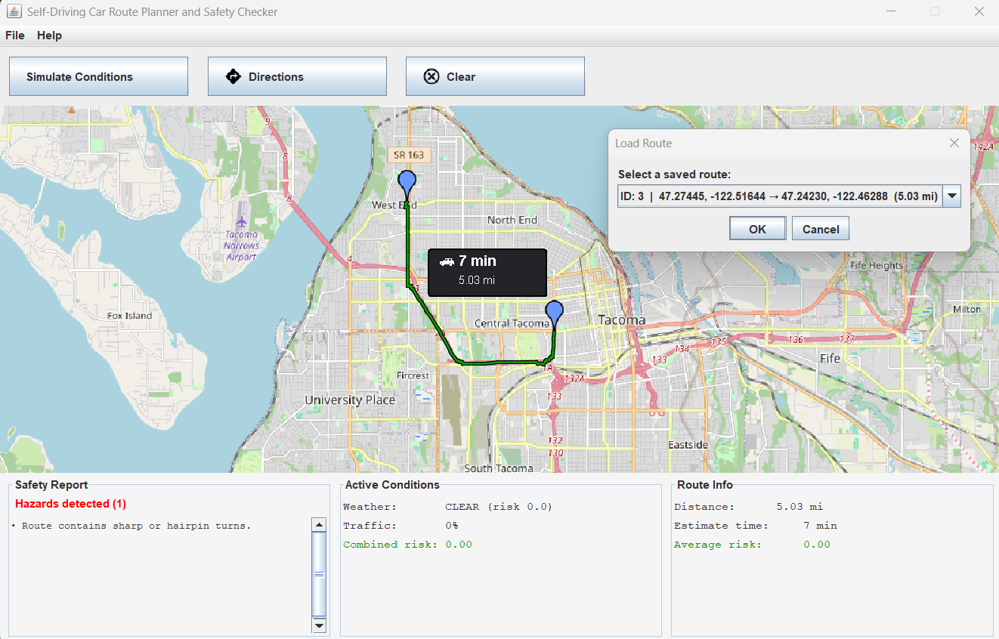

# Self-Driving Car Route Planner and Safety Checker

**Authors:** Chene Van der Walt, Sofiia Kabaldina, Abby Hinds  
**Version:** Spring 2026

---

## Overview

This application simulates a route-planning and safety-checking system for autonomous vehicles. 
It loads a real OpenStreetMap (.osm) file, lets you click a start and end point on an interactive map, 
computes the fastest route using the A* algorithm, simulates environmental conditions (weather, traffic, road obstacles), 
and reports safety hazards along the planned route. Routes can be saved to and loaded from a local SQLite database.

---

## Screenshots

### Main Screen


### Route Planning and Conditions

| Route with traffic | Route with traffic and weather conditions |
|---|---|
|  |  |

| Route with road obstacles | Cleared route |
|---|---|
|  |  |

### Saving and Loading Routes

| Save route | Load route |
|---|---|
|  |  |

---

## Prerequisites

| Requirement | Version |
|---|---|
| Java JDK | 17 or higher |
| Maven **or** Gradle | (whichever your project uses) |
| SQLite JDBC driver | bundled via dependency |
| Internet connection | required at first launch for map tiles |

---

## Project Structure

```
project-root/
├── src/
│   ├── main/
│   │   ├── java/
│   │   │   ├── controller/
│   │   │   │   ├── CarPlannerApp.java        ← Entry point
│   │   │   │   └── CarPlannerController.java
│   │   │   ├── model/
│   │   │   │   ├── AbstractModel.java
│   │   │   │   ├── DatabaseManager.java
│   │   │   │   ├── Environment.java
│   │   │   │   ├── EnvironmentSimulator.java
│   │   │   │   ├── Intersection.java
│   │   │   │   ├── MapGraph.java
│   │   │   │   ├── MapLoader.java
│   │   │   │   ├── PropertyChangeEnabled.java
│   │   │   │   ├── Road.java
│   │   │   │   ├── RoutePlanner.java
│   │   │   │   ├── RouteRecord.java
│   │   │   │   ├── SafetyChecker.java
│   │   │   │   └── TurnSharpness.java
│   │   │   └── view/
│   │   │       ├── ControlPanel.java
│   │   │       ├── MapPanel.java
│   │   │       ├── MenuBar.java
│   │   │       ├── ObstaclePainter.java
│   │   │       ├── PlannerDashboard.java
│   │   │       ├── RouteInfoPainter.java
│   │   │       ├── RoutePainter.java
│   │   │       ├── SafetyPanel.java
│   │   │       └── SimulationPanel.java
│   │   └── resources/
│   │       ├── map.osm            ← Tiny test map (a few blocks)
│   │       ├── map1.osm           ← Large map (Tacoma / Lakewood / Puyallup / Fife / Federal Way)
│   │       ├── test_map.osm       ← Small map used in unit tests
│   │       ├── clear.png
│   │       ├── directions-icon-size_128.png
│   │       └── obstacle.png
│   └── test/
│       └── java/                  ← JUnit tests for model classes
├── myRoutes.db                    ← SQLite database (auto-created on first run)
├── pom.xml / build.gradle
└── README.md
```

---

## How to Run

### Option A — IntelliJ IDEA (recommended)

1. Open IntelliJ and choose **File → Open**, then select the project root folder.
2. Let IntelliJ import the project and download dependencies (Maven/Gradle sync).
3. Locate `CarPlannerApp.java` in the `controller` package.
4. Right-click the file and select **Run 'CarPlannerApp.main()'**.
5. The map window will appear centered on Tacoma, WA.

### Option B — Eclipse

1. **File → Import → Existing Maven/Gradle Project** and select the project root.
2. Wait for the build to finish and all dependencies to resolve.
3. Right-click `CarPlannerApp.java` → **Run As → Java Application**.

### Option C — Command Line (Maven)

```bash
# From the project root directory:
mvn clean package
mvn exec:java -Dexec.mainClass="controller.CarPlannerApp"
```

### Option D — Command Line (Gradle)

```bash
./gradlew run
```

> **Note:** The application downloads OpenStreetMap tile images on first launch. An active internet connection is required for the map to render. If tiles fail to load, the route and waypoint overlays will still work — only the background map image will be absent.

---

## Choosing a Map

The map loaded at startup is controlled by the filename passed to `MapLoader.loadFromFile()` in `CarPlannerApp.java`:

| File | Coverage | Best for |
|---|---|---|
| `map.osm` | Tiny — a few city blocks | Quick smoke-tests; fast load |
| `map1.osm` | Large — Tacoma, Lakewood, Puyallup, Fife, Federal Way | Full demo and real routing |
| `test_map.osm` | Small — used by unit tests | Automated testing only |

To switch maps, open `CarPlannerApp.java` and change the filename in:

MapLoader.loadFromFile(graph, "map1.osm");  // ← change this string

---

## Using the Application

### 1. Select a Route
- **Left-click** anywhere on the map to set the **start point** (first click) and **end point** (second click).  
  Blue waypoint markers will appear at both selected locations.
- A third click resets the start point and clears the end point, letting you start over.
- Once both points are set, the **Get Directions** button becomes enabled.

### 2. Calculate a Route
- Click **Get Directions**.  
  The A* algorithm snaps your clicks to the nearest road intersections and computes the fastest route given current conditions.  
  The route is drawn as a colored line on the map, and a small pop-up near the start shows the estimated travel time and distance.

### 3. Simulate Conditions
- Click **Simulate Conditions** to open the simulation dialog.
    - **Weather Condition** — choose from CLEAR through ICY. Each option shows its risk factor.
    - **Traffic Density** — drag the slider from 0 % (no traffic) to 100 % (gridlock).
    - **Road Obstacles** — drag the slider to randomly block a percentage of roads on the graph.
    - The **Risk Preview** panel updates live as you adjust the sliders.
- Click **Apply Conditions** to push the settings to the map graph.  
  The route color and safety report update automatically.
- Click **Reset All** to clear all applied conditions and restore default (CLEAR / 0 % traffic / no obstacles).
- Click **Close** to dismiss the dialog without changing anything.

### 4. Read the Safety Report
The bottom panel has three sections:

| Section | Contents |
|---|---|
| **Safety Report** | Overall status ("Route is safe" or "Hazards detected") and a bulleted list of specific hazards |
| **Active Conditions** | Current weather, traffic percentage, and combined risk score |
| **Route Info** | Total distance in miles, estimated travel time, and average risk factor |

Hazards that may be reported:
- Blocked roads or intersections on the route
- Sharp or hairpin turns
- Dangerous weather + traffic combinations
- High overall risk

When the safety checker flags the primary route as unsafe, the planner automatically attempts to find a safer alternative before displaying the result.

### 5. Save and Load Routes
- **File → Save Route** — saves the currently displayed route (start label, end label, distance, duration, and hazards) to the local SQLite database (`myRoutes.db`).
- **File → Load Route** — opens a dialog listing all previously saved routes. Select one to reload it.

### 6. Clear the Map
- Click **Clear** to remove the current route, waypoints, and all overlays, and reset the safety panel to its default state.

### 7. Menu — Help
- **Help → About** — displays project and author information.
- **Help → Instructions** — shows a quick in-app guide.
- **Help → Exit** — closes the application.

---

## Running the Unit Tests

### IntelliJ / Eclipse
Right-click the `src/test/java/model` folder and choose **Run All Tests**.

### Maven
```bash
mvn test
```

### Gradle
```bash
./gradlew test
```

Tests cover the model layer — `MapGraph`, `RoutePlanner`, `SafetyChecker`, `EnvironmentSimulator`, `DatabaseManager`, `Road`, `Intersection`, `RouteRecord`, and the enum classes. The `DatabaseManager` tests run against an in-memory SQLite database (`jdbc:sqlite::memory:`) so they do not touch the production `myRoutes.db` file.

---

## Dependencies

The following libraries are required and should be declared in your `pom.xml` or `build.gradle`:

| Library | Purpose |
|---|---|
| `org.jxmapviewer:jxmapviewer2` | Interactive OpenStreetMap viewer |
| `org.xerial:sqlite-jdbc` | SQLite database connectivity |
| JUnit 5 (`org.junit.jupiter`) | Unit testing |

---

## Known Limitations

- The map tile background requires an internet connection. The route overlay works offline, but no background imagery will be visible.
- Very large `.osm` files (like `map1.osm`) may take a few seconds to parse and load on first launch.
- The application window is not resizable; it is sized to 70 % of your screen width and 80 % of your screen height.
- The SQLite database file (`myRoutes.db`) is created in the working directory from which the application is launched. In IntelliJ this is typically the project root.

---

## Troubleshooting

**Map tiles do not load**  
Check your internet connection. If you are behind a corporate proxy, you may need to configure Java's proxy settings.

**"Could not load map.osm" message in the console**  
The `.osm` file was not found on the classpath. Confirm that `map1.osm` (or whichever file you chose) is located in `src/main/resources/` and that your build tool is copying resources to the output directory.

**SQLite driver not found**  
Make sure the `org.xerial:sqlite-jdbc` dependency is present in your build file and that your IDE has refreshed its dependency cache.

**Application crashes with "RuntimeException: …"**  
This usually means the `DatabaseManager` failed to initialize. Check that your project has write permission to create `myRoutes.db` in the working directory.
